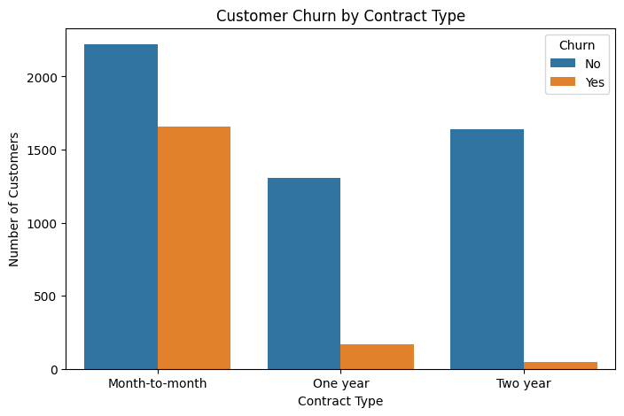
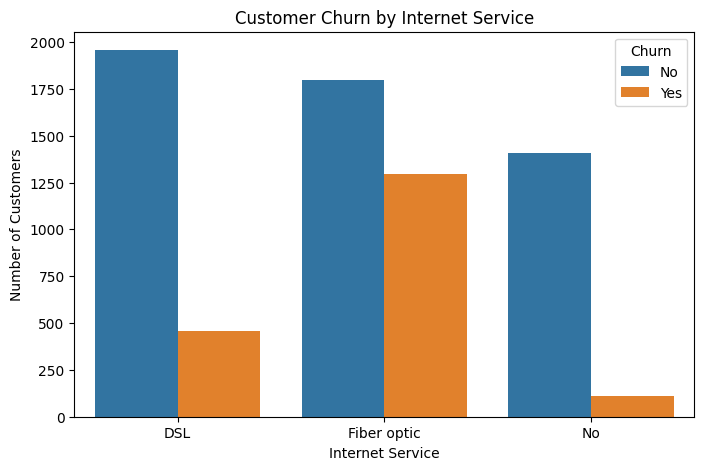
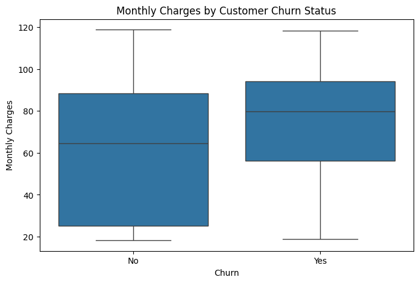
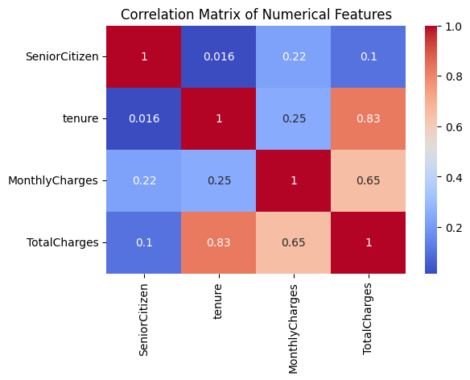

# 📊 Telco Customer Churn Analysis

**Every dataset has a story to tell.** This project uses Python (Pandas, Matplotlib, Seaborn) to uncover why customers leave a telecommunications company and turns those insights into concrete business recommendations.

---

## 📁 Table of Contents
- [Project Overview](#project-overview)
- [Business Problem](#business-problem)
- [Dataset](#dataset)
- [Tools Used](#tools-used)
- [Data Cleaning](#data-cleaning)
- [Key Visualizations](#key-visualizations)
- [Key Findings](#key-findings)
- [Business Recommendations](#business-recommendations)
- [Repository Structure](#repository-structure)

---

## Project Overview
This project analyzes customer churn for a telecommunications company using the Telco Customer Churn dataset. The goal is to identify the factors that influence customer churn, uncover patterns in customer behavior, and provide actionable business recommendations to improve retention.

## Business Problem
The company is losing a substantial share of its customer base, directly affecting revenue and long-term profitability. Since acquiring a new customer costs significantly more than retaining an existing one, this analysis answers:

 **What customer characteristics and service attributes are most strongly associated with churn and what can the company do about it?**

## Dataset
- **Source:** Telco Customer Churn dataset (`WA_Fn-UseC_-Telco-Customer-Churn.csv`)
- **Size:** 7,043 records × 21 columns (7,032 records after cleaning)
- **Key variables:**
  - **Demographics:** gender, Senior Citizen, Partner, Dependents
  - **Account & Contract:** tenure, Contract, Payment Method, Paperless Billing
  - **Services:** InternetService, Online Security, Online Backup, Device Protection, Tech Support, StreamingTV, Streaming Movies
  - **Billing:** Monthly Charges, Total Charges
  - **Target:** Churn (Yes/No)

## Tools Used
- **Python** Pandas, NumPy
- **Matplotlib & Seaborn** data visualization
- **Jupyter Notebook** analysis environment
- **Microsoft Word / PowerPoint** business report and presentation deliverables

## Data Cleaning
- Converted `Total Charges` from text to numeric format
- Identified and removed 11 incomplete records (blank `Total Charges` values)
- Confirmed no duplicate records in the dataset
- Final cleaned dataset: **7,032 rows, 21 columns**

## Key Visualizations

**Churn by Contract Type**





Month-to-month customers churn far more than one-year or two-year customers.

**Churn by Internet Service**





Fiber Optic customers churn the most; customers with no internet service churn the least.

**Monthly Charges by Churn Status**





Churned customers have a higher median monthly charge (approx. $80) than retained customers (approx. $65).

**Correlation Matrix of Numerical Features**





Tenure and TotalCharges are strongly correlated (0.83); MonthlyCharges and tenure are only weakly related (0.25).

## Key Findings
- Of 7,032 customers analyzed, **1,869 (26.6%) churned** and 5,163 (73.4%) were retained.
- **Gender** shows no meaningful difference in churn behavior.
- **Contract type** is a strong predictor: month-to-month customers churn far more than one-year or two-year customers.
- **Internet service type** matters: Fiber Optic customers churn the most, DSL less, and no-internet customers the least.
- **Monthly Charges** show a bimodal distribution — one cluster around $20/month, another between $70–$100/month.
- **Tenure** is also bimodal many customers with very short tenure (1–5 months) and another large group near the maximum (~72 months).
- Churned customers have a **higher median Monthly Charge (~$80)** than retained customers (~$65).
- **Tenure and TotalCharges** are strongly correlated (0.83); **MonthlyCharges and tenure** are only weakly correlated (0.25) meaning high pricing is an independent churn risk, not just a newer customer effect.

## Business Recommendations
1. **Incentivize contract upgrades**: offer discounts, loyalty rewards, or bundles to move month-to-month customers to longer-term contracts.
2. **Strengthen early lifecycle retention**:  structured onboarding, welcome offers, and proactive check-ins during the first six months.
3. **Investigate Fiber Optic service quality**:  customer satisfaction surveys and service audits to address high churn in this segment.
4. **Target high bill customers for retention outreach**: flag customers with Monthly Charges above ~$70 as higher risk.
5. **Avoid redundant modeling variables**: account for the tenure/Total Charges correlation to avoid multicollinearity in future predictive models.

## Repository Structure
```
Telco-Customer-Churn-Analysis/
├── Telco_Customer_Churn.ipynb          # Full EDA notebook
├── WA_Fn-UseC_-Telco-Customer-Churn.csv # Raw dataset
├── Telco_Churn_Case_Study_Report.docx  # Business analytics case study report
├── Telco_Churn_Presentation.pptx       # Business presentation
├── images/                             # Exported chart images
└── README.md
```

## Analyst 
**Benjamin Umanta Esther**

*I use SQL, Excel, Python, and Power BI to uncover the insights hidden beneath the numbers and turn data into decisions.*
